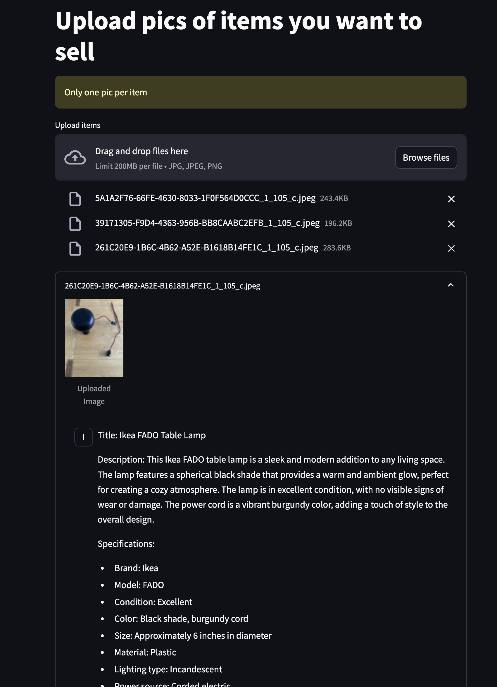

# Sell your stuff

This is a sample project to demonstrate how to use claude vision. 

## How to start

```bash
pip install
export ANTHROPIC_API_KEY=your_api_key
streamlit run main.py
```

## How to use

Pick images of items you want to sell and description will be generated for you.




